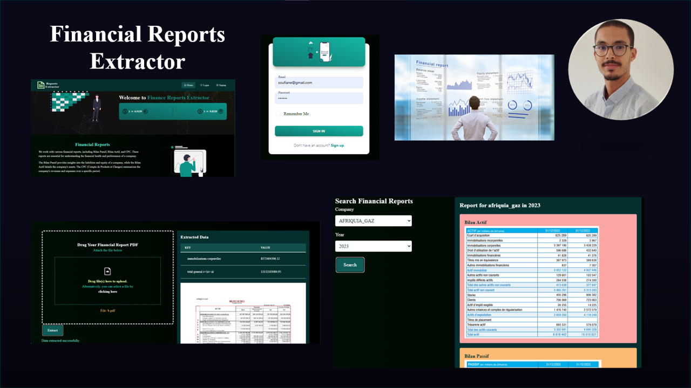

# Financial Statement Extraction and Analysis Tool

## Description

This project involves the development of a comprehensive web-based application designed to extract and analyze financial statements from PDF documents. The application is built with a Flask backend and a React frontend, offering a seamless user experience for interacting with financial data.

## Key Features

- **PDF to Image Conversion**: The backend processes uploaded PDF files, converting them into images for further analysis.
- **Financial Data Extraction**: Utilizing advanced image processing techniques, the tool identifies and crops relevant sections of financial reports, such as balance sheets ("bilan actif" and "bilan passif") and income statements ("CPC").
- **Data Presentation**: Extracted financial data is presented in a clear and organized manner, with options to view associated images directly within the web interface.
- **Company and Year Selection**: Users can easily select a company and a specific year to retrieve and display corresponding financial statements, enabling quick access to historical financial data.
- **Responsive Design**: The frontend is designed to be user-friendly and responsive, ensuring accessibility across various devices.
- **Secure and Scalable**: Built with security and scalability in mind, the application leverages PostgreSQL for robust data storage and Flask for secure backend operations.

## Technologies Used

- **Frontend**: React, Tailwind CSS
- **Backend**: Flask, Python, JWT Authentication
- **Database**: PostgreSQL
- **Others**: OpenCV, PyTesseract for OCR

## Use Cases

This tool is ideal for financial analysts, auditors, and business professionals who need to extract and analyze financial data from corporate reports quickly and efficiently. By automating the extraction process, the tool saves time and reduces the potential for human error.

## Getting Started

### Prerequisites

- Python
- Node.js and npm
- PostgreSQL

### Installation

Clone the repository:
   ```bash
   git clone https://github.com/yourusername/financial-statement-extraction.git
   ```


<div style="background-color:#4c4893; color:white; font-size:15px; font-family:Comic Sans MS; padding:10px; border: 5px solid black;font-weight:bold;border-radius: 20px;text-align:center"> ✨ THE END ✨</div><br>